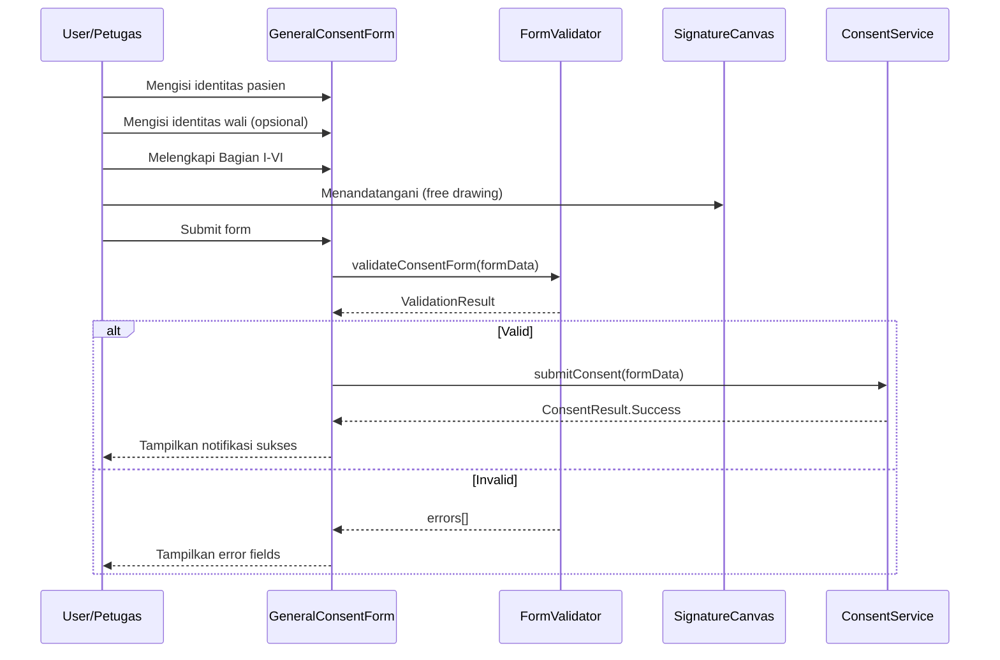
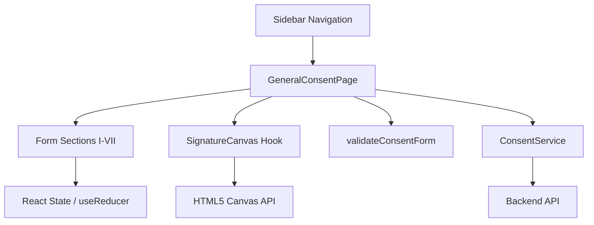

# Design Document: General Consent

## Overview

Fitur General Consent (GC) menambahkan halaman formulir digital berdasarkan dokumen RM-064/RSG dari RS Tk.IV 03.07.04 Guntur ke dalam SIMRS. Halaman ini mencakup 7 bagian persetujuan dengan free-drawing canvas untuk tanda tangan digital.

## Main Algorithm/Workflow



## Architecture



## Components and Interfaces

### Component: GeneralConsentPage
**Purpose**: Halaman utama form General Consent dengan 7 bagian persetujuan dan tanda tangan digital.

### Component: SignatureCanvas
**Purpose**: Canvas free-drawing untuk menangkap tanda tangan pasien/wali dan petugas RS.

### Component: SectionIdentitasPasien - SectionInformasiBiaya
**Purpose**: Masing-masing section form yang dapat di-collapse/expand dengan animasi Framer Motion.

## Data Models

### Model: GeneralConsentFormData
Struktur data lengkap yang merepresentasikan seluruh isian form General Consent, mencakup identitas pasien, identitas wali, 6 bagian persetujuan, dan tanda tangan digital.

## Core Interfaces/Types

```typescript
// === Identitas Pasien ===
interface PatientIdentity {
  nama: string;
  tanggalLahir: string; // ISO date string
  umur: number;
  noRekamMedis: string;
  nik: string;
  alamat: string;
  noTelepon: string;
}

// === Identitas Penanda Tangan/Wali ===
interface SignerIdentity {
  nama: string;
  tanggalLahir: string;
  usia: number;
  alamat: string;
  noTelepon: string;
  hubunganDenganPasien: HubunganPasien;
}

type HubunganPasien =
  | 'suami'
  | 'istri'
  | 'ayah'
  | 'ibu'
  | 'anak'
  | 'saudara'
  | 'wali'
  | 'lainnya';

// === Bagian I: Persetujuan Perawatan & Pengobatan ===
interface BagianPersetujuanPerawatan {
  menyetujuiPerawatan: boolean;
  memahamiInformasiMedis: boolean;
}

// === Bagian II: Persetujuan Pelepasan Informasi ===
interface AnggotaKeluargaBerwenang {
  nama: string;
  hubungan: HubunganPasien;
  noTelepon: string;
}

interface BagianPersetujuanInformasi {
  menyetujuiPelepasanInformasi: boolean;
  anggotaKeluargaBerwenang: AnggotaKeluargaBerwenang[];
}

// === Bagian III: Hak dan Kewajiban ===
interface BagianHakKewajiban {
  memahamiHakPasien: boolean;
  memahamiKewajiban: boolean;
}

// === Bagian IV: Informasi Rawat Inap ===
interface BagianInformasiRawatInap {
  memahamiProsedurRawatInap: boolean;
  memahamiPeraturanRS: boolean;
}

// === Bagian V: Privasi ===
type PersetujuanPengunjung = 'mengijinkan' | 'tidak_mengijinkan';

interface BagianPrivasi {
  memahamiKebijakanPrivasi: boolean;
  persetujuanPengunjung: PersetujuanPengunjung;
}

// === Bagian VI: Informasi Biaya ===
interface BagianInformasiBiaya {
  memahamiKebijakanBiaya: boolean;
  memahamiMetodePembayaran: boolean;
}

// === Bagian VII: Tanda Tangan ===
interface SignatureData {
  dataUrl: string; // base64 PNG dari canvas
  signedAt: string; // ISO datetime
}

interface BagianTandaTangan {
  tandaTanganPasienWali: SignatureData | null;
  tandaTanganPetugas: SignatureData | null;
}

// === Form Data Lengkap ===
interface GeneralConsentFormData {
  identitasPasien: PatientIdentity;
  identitasWali: SignerIdentity | null;
  bagianI: BagianPersetujuanPerawatan;
  bagianII: BagianPersetujuanInformasi;
  bagianIII: BagianHakKewajiban;
  bagianIV: BagianInformasiRawatInap;
  bagianV: BagianPrivasi;
  bagianVI: BagianInformasiBiaya;
  bagianVII: BagianTandaTangan;
  createdAt: string;
  createdBy: string; // user ID petugas
}

// === Validation ===
interface ValidationError {
  field: string;
  message: string;
}

type ValidationResult =
  | { valid: true }
  | { valid: false; errors: ValidationError[] };

// === API Result ===
type ConsentResult =
  | { success: true; consentId: string }
  | { success: false; error: string };
```

## Key Functions with Formal Specifications

### Function 1: validateConsentForm()

```typescript
function validateConsentForm(data: GeneralConsentFormData): ValidationResult
```

**Preconditions:**
- `data` is non-null and conforms to `GeneralConsentFormData` shape
- All string fields are trimmed

**Postconditions:**
- Returns `{ valid: true }` if and only if ALL required fields are filled and valid
- Returns `{ valid: false, errors }` with at least one error if any validation fails
- NIK must be exactly 16 digits
- noRekamMedis must match existing format (non-empty)
- At least one tanda tangan (pasien/wali) must exist
- Tanda tangan petugas must exist
- If `identitasWali` is not null, all wali fields must be filled
- `bagianII.anggotaKeluargaBerwenang` must have at least 1 entry

**Loop Invariants:** N/A

### Function 2: useSignatureCanvas()

```typescript
function useSignatureCanvas(canvasRef: React.RefObject<HTMLCanvasElement>): {
  startDrawing: (e: React.MouseEvent | React.TouchEvent) => void;
  draw: (e: React.MouseEvent | React.TouchEvent) => void;
  stopDrawing: () => void;
  clear: () => void;
  isEmpty: () => boolean;
  toDataURL: () => string;
}
```

**Preconditions:**
- `canvasRef.current` is mounted and accessible in the DOM
- Canvas element has explicit width and height attributes

**Postconditions:**
- `startDrawing` begins a new path at pointer position
- `draw` extends current path if drawing is active (no-op otherwise)
- `stopDrawing` ends the current path
- `clear` resets canvas to blank state; `isEmpty()` returns true after clear
- `isEmpty()` returns true only when no strokes have been drawn since last clear
- `toDataURL()` returns valid base64 PNG string of current canvas state

**Loop Invariants:** N/A

### Function 3: submitConsent()

```typescript
async function submitConsent(data: GeneralConsentFormData): Promise<ConsentResult>
```

**Preconditions:**
- `validateConsentForm(data).valid === true`
- User is authenticated (valid session token exists)

**Postconditions:**
- On success: returns `{ success: true, consentId }` with unique consent ID
- On network/server failure: returns `{ success: false, error }` with descriptive message
- Form data is persisted to backend storage
- No partial writes (atomic operation)

**Loop Invariants:** N/A

### Function 4: GeneralConsentPage component

```typescript
function GeneralConsentPage(): React.ReactElement
```

**Preconditions:**
- Component is rendered within authenticated route (`/dashboard/general-consent`)
- MODULES constant includes general-consent entry

**Postconditions:**
- Renders form with all 7 sections in sequential order
- Each section is collapsible/expandable with Framer Motion animation
- Signature canvases render at minimum 300x150 pixels
- Form state is managed via React useState/useReducer
- Submit button is disabled until form passes validation
- Validation errors are displayed inline next to respective fields

## Algorithmic Pseudocode

### Form Validation Algorithm

```typescript
function validateConsentForm(data: GeneralConsentFormData): ValidationResult {
  const errors: ValidationError[] = [];

  // Step 1: Validate Patient Identity
  if (!data.identitasPasien.nama.trim()) {
    errors.push({ field: 'identitasPasien.nama', message: 'Nama pasien wajib diisi' });
  }
  if (!data.identitasPasien.nik || data.identitasPasien.nik.length !== 16) {
    errors.push({ field: 'identitasPasien.nik', message: 'NIK harus 16 digit' });
  }
  if (!data.identitasPasien.noRekamMedis.trim()) {
    errors.push({ field: 'identitasPasien.noRekamMedis', message: 'No. Rekam Medis wajib diisi' });
  }
  if (!data.identitasPasien.tanggalLahir) {
    errors.push({ field: 'identitasPasien.tanggalLahir', message: 'Tanggal lahir wajib diisi' });
  }
  if (!data.identitasPasien.alamat.trim()) {
    errors.push({ field: 'identitasPasien.alamat', message: 'Alamat wajib diisi' });
  }
  if (!data.identitasPasien.noTelepon.trim()) {
    errors.push({ field: 'identitasPasien.noTelepon', message: 'No. Telepon wajib diisi' });
  }

  // Step 2: Validate Signer/Wali if provided
  if (data.identitasWali) {
    const wali = data.identitasWali;
    if (!wali.nama.trim()) {
      errors.push({ field: 'identitasWali.nama', message: 'Nama wali wajib diisi' });
    }
    if (!wali.hubunganDenganPasien) {
      errors.push({ field: 'identitasWali.hubunganDenganPasien', message: 'Hubungan wali wajib dipilih' });
    }
  }

  // Step 3: Validate Section II - at least 1 family member
  if (data.bagianII.anggotaKeluargaBerwenang.length === 0) {
    errors.push({ field: 'bagianII.anggotaKeluargaBerwenang', message: 'Minimal 1 anggota keluarga berwenang' });
  }
  for (let i = 0; i < data.bagianII.anggotaKeluargaBerwenang.length; i++) {
    const member = data.bagianII.anggotaKeluargaBerwenang[i];
    if (!member.nama.trim()) {
      errors.push({ field: `bagianII.anggotaKeluargaBerwenang[${i}].nama`, message: 'Nama wajib diisi' });
    }
  }

  // Step 4: Validate Section V - privacy choice
  if (!data.bagianV.persetujuanPengunjung) {
    errors.push({ field: 'bagianV.persetujuanPengunjung', message: 'Pilihan pengunjung wajib dipilih' });
  }

  // Step 5: Validate Signatures
  if (!data.bagianVII.tandaTanganPasienWali) {
    errors.push({ field: 'bagianVII.tandaTanganPasienWali', message: 'Tanda tangan pasien/wali wajib diisi' });
  }
  if (!data.bagianVII.tandaTanganPetugas) {
    errors.push({ field: 'bagianVII.tandaTanganPetugas', message: 'Tanda tangan petugas wajib diisi' });
  }

  return errors.length === 0
    ? { valid: true }
    : { valid: false, errors };
}
```

### Signature Canvas Hook Algorithm

```typescript
function useSignatureCanvas(canvasRef: React.RefObject<HTMLCanvasElement>) {
  const isDrawingRef = useRef(false);
  const hasStrokesRef = useRef(false);

  const getCoordinates = (e: React.MouseEvent | React.TouchEvent): { x: number; y: number } => {
    const canvas = canvasRef.current!;
    const rect = canvas.getBoundingClientRect();
    if ('touches' in e) {
      return {
        x: e.touches[0].clientX - rect.left,
        y: e.touches[0].clientY - rect.top,
      };
    }
    return { x: e.clientX - rect.left, y: e.clientY - rect.top };
  };

  const startDrawing = (e: React.MouseEvent | React.TouchEvent) => {
    const ctx = canvasRef.current?.getContext('2d');
    if (!ctx) return;
    isDrawingRef.current = true;
    const { x, y } = getCoordinates(e);
    ctx.beginPath();
    ctx.moveTo(x, y);
  };

  const draw = (e: React.MouseEvent | React.TouchEvent) => {
    if (!isDrawingRef.current) return;
    const ctx = canvasRef.current?.getContext('2d');
    if (!ctx) return;
    const { x, y } = getCoordinates(e);
    ctx.lineTo(x, y);
    ctx.stroke();
    hasStrokesRef.current = true;
  };

  const stopDrawing = () => {
    isDrawingRef.current = false;
  };

  const clear = () => {
    const canvas = canvasRef.current;
    if (!canvas) return;
    const ctx = canvas.getContext('2d');
    if (!ctx) return;
    ctx.clearRect(0, 0, canvas.width, canvas.height);
    hasStrokesRef.current = false;
  };

  const isEmpty = () => !hasStrokesRef.current;

  const toDataURL = () => canvasRef.current?.toDataURL('image/png') ?? '';

  return { startDrawing, draw, stopDrawing, clear, isEmpty, toDataURL };
}
```

### Component Tree Structure

```typescript
// Page-level component structure
// GeneralConsentPage
//   ├── SectionIdentitasPasien (form fields)
//   ├── SectionIdentitasWali (toggleable, form fields)
//   ├── SectionPersetujuanPerawatan (checkboxes)
//   ├── SectionPersetujuanInformasi (checkboxes + dynamic list)
//   ├── SectionHakKewajiban (checkboxes)
//   ├── SectionInformasiRawatInap (checkboxes)
//   ├── SectionPrivasi (radio buttons)
//   ├── SectionInformasiBiaya (checkboxes)
//   ├── SectionTandaTangan
//   │     ├── SignatureCanvas (Pasien/Wali)
//   │     └── SignatureCanvas (Petugas)
//   └── SubmitButton
```

## Example Usage

```typescript
// === 1. Adding module to constants/modules.ts ===
// Add to MODULES array:
{ id: 'general-consent', label: 'General Consent', icon: 'ClipboardCheck', path: '/dashboard/general-consent', colorScheme: 'slate', description: 'Formulir persetujuan umum' }

// === 2. Adding route to App.tsx ===
const GeneralConsent = lazy(() => import('@/pages/general-consent/index'));
// Inside <Route path="/dashboard"> children:
<Route path="general-consent" element={<GeneralConsent />} />

// === 3. Using SignatureCanvas component ===
import { useRef } from 'react';
import { useSignatureCanvas } from '@/hooks/useSignatureCanvas';

function SignatureCanvas({ label, onSign }: { label: string; onSign: (data: SignatureData) => void }) {
  const canvasRef = useRef<HTMLCanvasElement>(null);
  const { startDrawing, draw, stopDrawing, clear, isEmpty, toDataURL } = useSignatureCanvas(canvasRef);

  const handleConfirm = () => {
    if (isEmpty()) return;
    onSign({ dataUrl: toDataURL(), signedAt: new Date().toISOString() });
  };

  return (
    <div className="space-y-2">
      <label className="text-sm font-medium text-gray-700">{label}</label>
      <canvas
        ref={canvasRef}
        width={400}
        height={200}
        className="w-full border border-gray-300 rounded-lg cursor-crosshair touch-none"
        onMouseDown={startDrawing}
        onMouseMove={draw}
        onMouseUp={stopDrawing}
        onMouseLeave={stopDrawing}
        onTouchStart={startDrawing}
        onTouchMove={draw}
        onTouchEnd={stopDrawing}
      />
      <div className="flex gap-2">
        <button onClick={clear} className="px-3 py-1 text-sm text-gray-600 border rounded hover:bg-gray-50">
          Hapus
        </button>
        <button onClick={handleConfirm} className="px-3 py-1 text-sm text-white bg-blue-600 rounded hover:bg-blue-700">
          Konfirmasi
        </button>
      </div>
    </div>
  );
}

// === 4. Form submission flow ===
const handleSubmit = async () => {
  const result = validateConsentForm(formData);
  if (!result.valid) {
    setErrors(result.errors);
    return;
  }
  setIsSubmitting(true);
  const response = await submitConsent(formData);
  if (response.success) {
    navigate('/dashboard');
    showNotification('General Consent berhasil disimpan');
  } else {
    setSubmitError(response.error);
  }
  setIsSubmitting(false);
};

// === 5. Dynamic family member list (Bagian II) ===
const addAnggotaKeluarga = () => {
  setFormData(prev => ({
    ...prev,
    bagianII: {
      ...prev.bagianII,
      anggotaKeluargaBerwenang: [
        ...prev.bagianII.anggotaKeluargaBerwenang,
        { nama: '', hubungan: 'lainnya', noTelepon: '' }
      ]
    }
  }));
};

const removeAnggotaKeluarga = (index: number) => {
  setFormData(prev => ({
    ...prev,
    bagianII: {
      ...prev.bagianII,
      anggotaKeluargaBerwenang: prev.bagianII.anggotaKeluargaBerwenang.filter((_, i) => i !== index)
    }
  }));
};
```

## Error Handling

### Error: Validasi Form Gagal
**Condition**: User submit form dengan field wajib kosong atau format salah
**Response**: Tampilkan pesan error inline per field, scroll ke error pertama
**Recovery**: User memperbaiki field lalu submit ulang

### Error: Tanda Tangan Kosong
**Condition**: User submit tanpa menandatangani canvas
**Response**: Highlight border canvas merah, tampilkan pesan "Tanda tangan wajib diisi"
**Recovery**: User menggambar tanda tangan lalu submit ulang

### Error: Network/Server Failure
**Condition**: API call gagal karena koneksi atau server error
**Response**: Tampilkan alert error dengan pesan deskriptif, form data tetap tersimpan di state
**Recovery**: User coba submit ulang tanpa perlu mengisi ulang form

## Testing Strategy

### Unit Testing Approach
- Test `validateConsentForm` dengan berbagai kombinasi input valid dan invalid
- Test `useSignatureCanvas` hook behavior (start, draw, stop, clear, isEmpty)
- Test masing-masing section component renders correctly

### Property-Based Testing Approach
- Property: Form dengan semua field valid selalu lolos validasi
- Property: Form tanpa tanda tangan selalu gagal validasi
- Property: Validation result deterministic untuk input yang sama

**Property Test Library**: fast-check (jika tersedia) atau manual property tests

## Correctness Properties

### Property 1: Form validation is deterministic
∀ data: GeneralConsentFormData, validateConsentForm(data) === validateConsentForm(data)

### Property 2: Valid form implies all required fields present
∀ data: GeneralConsentFormData, validateConsentForm(data).valid === true ⟹ data.identitasPasien.nik.length === 16 ∧ data.identitasPasien.nama.trim() !== '' ∧ data.bagianII.anggotaKeluargaBerwenang.length >= 1 ∧ data.bagianVII.tandaTanganPasienWali !== null ∧ data.bagianVII.tandaTanganPetugas !== null

### Property 3: Signature canvas clear resets state
∀ canvas: SignatureCanvas, canvas.clear() ⟹ canvas.isEmpty() === true

### Property 4: Signature toDataURL produces valid PNG
∀ canvas: SignatureCanvas where !canvas.isEmpty(), canvas.toDataURL().startsWith('data:image/png;base64,')

### Property 5: Invalid form always has at least one error
∀ data: GeneralConsentFormData, validateConsentForm(data).valid === false ⟹ validateConsentForm(data).errors.length >= 1

### Property 6: Module placement - GC appears last in sidebar
MODULES[MODULES.length - 1].id === 'general-consent'
