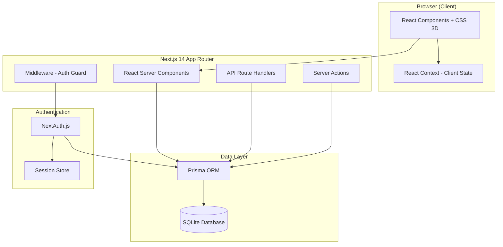
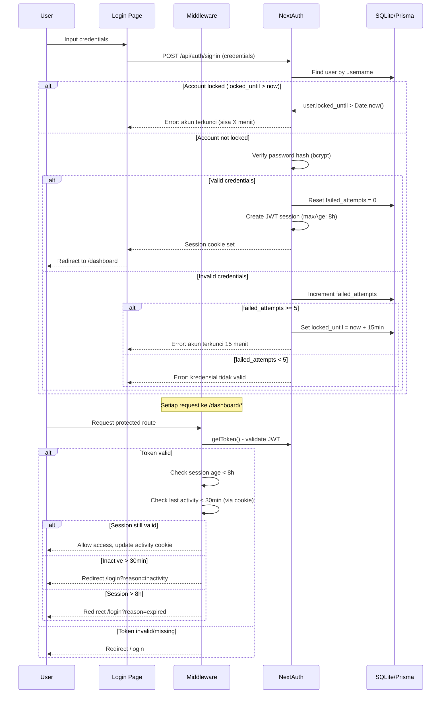
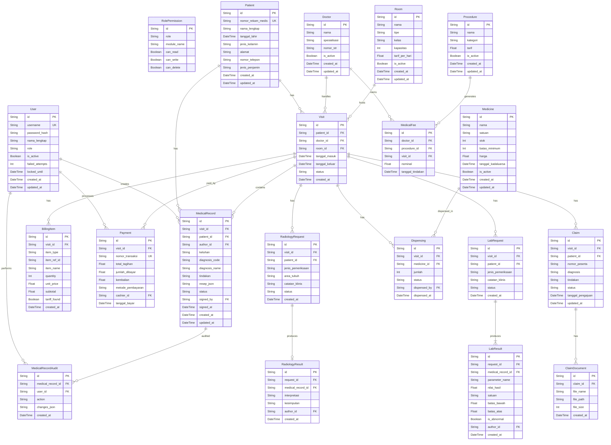

# Dokumen Desain - SIMRS (Sistem Informasi Manajemen Rumah Sakit)

## Overview

SIMRS adalah aplikasi web berbasis Next.js 14 (App Router) yang menyediakan sistem informasi manajemen rumah sakit lengkap dengan 16 modul operasional. Sistem ini menggunakan arsitektur monolitik modern dengan server-side rendering, API routes internal, dan antarmuka pengguna 2D/3D yang menarik menggunakan CSS transforms.

### Keputusan Teknis Utama

| Aspek | Keputusan | Alasan |
|-------|-----------|--------|
| Framework | Next.js 14 App Router | SSR, file-based routing, React Server Components |
| UI | Tailwind CSS + CSS 3D Transforms | Styling cepat, animasi native tanpa library tambahan |
| Auth | NextAuth.js (Credentials Provider) | Integrasi mudah dengan Next.js, session management built-in |
| Database | SQLite + Prisma ORM | Lightweight, tanpa DB server terpisah, migrasi mudah |
| State | React Context + Server Components | Minimal client-side state, leveraging RSC |
| Bahasa | TypeScript | Type safety, developer experience |

## Architecture

### Arsitektur Tingkat Tinggi



### Struktur Direktori App Router

```
src/
├── app/
│   ├── layout.tsx              # Root layout + providers
│   ├── page.tsx                # Redirect ke /login
│   ├── login/
│   │   └── page.tsx            # Halaman login
│   ├── dashboard/
│   │   ├── layout.tsx          # Layout autentikasi + sidebar
│   │   ├── page.tsx            # Dashboard utama (grid modul)
│   │   ├── referensi/
│   │   │   └── page.tsx
│   │   ├── admission/
│   │   │   └── page.tsx
│   │   ├── rme/
│   │   │   └── page.tsx
│   │   ├── billing/
│   │   │   └── page.tsx
│   │   ├── radiologi/
│   │   │   └── page.tsx
│   │   ├── laboratorium/
│   │   │   └── page.tsx
│   │   ├── farmasi/
│   │   │   └── page.tsx
│   │   ├── kasir/
│   │   │   └── page.tsx
│   │   ├── klaim/
│   │   │   └── page.tsx
│   │   ├── jasa/
│   │   │   └── page.tsx
│   │   ├── pengaturan/
│   │   │   └── page.tsx
│   │   └── billing-real/
│   │       └── page.tsx
│   └── api/
│       ├── auth/[...nextauth]/
│       │   └── route.ts        # NextAuth handler
│       ├── referensi/
│       │   └── route.ts
│       ├── admission/
│       │   ├── route.ts        # CRUD pasien
│       │   └── search/
│       │       └── route.ts    # Pencarian pasien
│       ├── rme/
│       │   ├── route.ts
│       │   └── [id]/
│       │       ├── route.ts
│       │       └── sign/
│       │           └── route.ts
│       ├── billing/
│       │   └── [visitId]/
│       │       └── route.ts
│       ├── radiologi/
│       │   ├── route.ts        # Request + queue
│       │   └── [id]/
│       │       └── result/
│       │           └── route.ts
│       ├── laboratorium/
│       │   ├── route.ts
│       │   └── [id]/
│       │       └── result/
│       │           └── route.ts
│       ├── farmasi/
│       │   ├── route.ts        # Stok obat
│       │   └── dispense/
│       │       └── route.ts
│       ├── kasir/
│       │   └── route.ts        # Payment processing
│       ├── klaim/
│       │   ├── route.ts
│       │   └── [id]/
│       │       └── status/
│       │           └── route.ts
│       ├── jasa/
│       │   ├── route.ts        # Rekapitulasi
│       │   └── export/
│       │       └── route.ts    # PDF export
│       ├── pengaturan/
│       │   ├── users/
│       │   │   └── route.ts
│       │   └── roles/
│       │       └── route.ts
│       └── billing-real/
│           └── route.ts
├── components/
│   ├── ui/                     # Card3D, Button, Input, DataTable, Modal
│   ├── layout/                 # Sidebar, Header, Breadcrumb
│   └── modules/                # Komponen spesifik per modul
├── lib/
│   ├── auth.ts                 # Konfigurasi NextAuth
│   ├── prisma.ts               # Prisma client singleton
│   ├── validators/             # Zod schemas per modul
│   └── utils/                  # Currency formatter, date utils
├── contexts/
│   └── session-context.tsx     # Client-side session monitoring
├── types/
│   └── index.ts                # Shared TypeScript types
└── prisma/
    ├── schema.prisma
    └── seed.ts
```

### Alur Request

1. **Client Request** → Next.js Middleware (cek auth via NextAuth)
2. **Authenticated** → React Server Component (fetch data via Prisma)
3. **Render** → HTML streamed + Client Components (interaktivitas)
4. **Mutasi** → Server Actions / API Routes → Prisma → SQLite
5. **Real-time** → Polling setiap 5 detik untuk Billing Real-Time (Req 16.2)

## Components and Interfaces

### Komponen Layout

```typescript
// components/layout/AppShell.tsx
interface AppShellProps {
  children: React.ReactNode;
}

// components/layout/Sidebar.tsx
interface SidebarProps {
  activeModule: string;
  userRole: string;
  modules: ModuleItem[];
}

// components/layout/Header.tsx
interface HeaderProps {
  userName: string;
  userRole: string;
  onLogout: () => void;
}

// components/layout/Breadcrumb.tsx
interface BreadcrumbProps {
  items: { label: string; href: string }[];
}
```

### Komponen UI 2D/3D

```typescript
// components/ui/Card3D.tsx
interface Card3DProps {
  icon: React.ReactNode;
  label: string;
  href: string;
  disabled?: boolean;
  error?: boolean;
  index?: number; // untuk staggered entrance animation
}
// Efek hover: perspective rotate max 5deg, elevasi max 8px, transisi 300ms
// Entrance animation: fade + translateY, max 500ms
// Respects prefers-reduced-motion media query

// components/ui/DataTable.tsx
interface DataTableProps<T> {
  data: T[];
  columns: ColumnDef<T>[];
  pagination: { page: number; pageSize: number; total: number };
  onPageChange: (page: number) => void;
  loading?: boolean;
  emptyMessage?: string;
}

// components/ui/FormField.tsx
interface FormFieldProps {
  label: string;
  name: string;
  type: 'text' | 'number' | 'date' | 'select' | 'textarea';
  required?: boolean;
  error?: string;
  maxLength?: number;
  options?: { value: string; label: string }[];
}

// components/ui/StatusBadge.tsx
interface StatusBadgeProps {
  status: string;
  variant: 'success' | 'warning' | 'danger' | 'info' | 'neutral';
}

// components/ui/ConfirmDialog.tsx
interface ConfirmDialogProps {
  open: boolean;
  title: string;
  message: string;
  onConfirm: () => void;
  onCancel: () => void;
  variant?: 'danger' | 'warning' | 'info';
}
```

### API Route Interfaces

```typescript
// Pola respons standar untuk semua API routes
interface ApiResponse<T> {
  success: boolean;
  data?: T;
  error?: {
    code: string;
    message: string;
    fields?: Record<string, string>; // per-field validation errors
  };
  pagination?: {
    page: number;
    pageSize: number;
    total: number;
    totalPages: number;
  };
}
```

### Authentication Flow



### Implementasi Middleware

```typescript
// middleware.ts
import { withAuth } from "next-auth/middleware";
import { NextResponse } from "next/server";

export default withAuth(
  function middleware(req) {
    const token = req.nextauth.token;
    const lastActivity = req.cookies.get("last_activity")?.value;
    const now = Date.now();

    // Cek session timeout 8 jam
    if (token?.iat && now - (token.iat as number) * 1000 > 8 * 60 * 60 * 1000) {
      return NextResponse.redirect(new URL("/login?reason=expired", req.url));
    }

    // Cek inactivity 30 menit
    if (lastActivity && now - parseInt(lastActivity) > 30 * 60 * 1000) {
      return NextResponse.redirect(new URL("/login?reason=inactivity", req.url));
    }

    // Update last activity
    const response = NextResponse.next();
    response.cookies.set("last_activity", now.toString(), { httpOnly: true });
    return response;
  },
  { pages: { signIn: "/login" } }
);

export const config = { matcher: ["/dashboard/:path*"] };
```

## Data Models

### Entity Relationship Diagram



### Prisma Schema (Inti)

```prisma
datasource db {
  provider = "sqlite"
  url      = env("DATABASE_URL") // file:./dev.db
}

generator client {
  provider = "prisma-client-js"
}

model User {
  id             String    @id @default(cuid())
  username       String    @unique
  passwordHash   String    @map("password_hash")
  namaLengkap    String    @map("nama_lengkap")
  role           String    // admin, dokter, perawat, kasir, apoteker, radiografer, analis_lab
  isActive       Boolean   @default(true) @map("is_active")
  failedAttempts Int       @default(0) @map("failed_attempts")
  lockedUntil    DateTime? @map("locked_until")
  createdAt      DateTime  @default(now()) @map("created_at")
  updatedAt      DateTime  @updatedAt @map("updated_at")

  medicalRecords MedicalRecord[] @relation("Author")
  signedRecords  MedicalRecord[] @relation("Signer")
  audits         MedicalRecordAudit[]
  payments       Payment[]
  dispensings    Dispensing[]

  @@map("users")
}

model RolePermission {
  id         String  @id @default(cuid())
  role       String
  moduleName String  @map("module_name")
  canRead    Boolean @default(false) @map("can_read")
  canWrite   Boolean @default(false) @map("can_write")
  canDelete  Boolean @default(false) @map("can_delete")

  @@unique([role, moduleName])
  @@map("role_permissions")
}

model Patient {
  id              String   @id @default(cuid())
  nomorRekamMedis String   @unique @map("nomor_rekam_medis")
  namaLengkap     String   @map("nama_lengkap")
  tanggalLahir    DateTime @map("tanggal_lahir")
  jenisKelamin    String   @map("jenis_kelamin") // L, P
  alamat          String
  nomorTelepon    String   @map("nomor_telepon")
  jenisPenjamin   String   @map("jenis_penjamin") // umum, bpjs, asuransi
  createdAt       DateTime @default(now()) @map("created_at")
  updatedAt       DateTime @updatedAt @map("updated_at")

  visits         Visit[]
  medicalRecords MedicalRecord[]
  radiologyReqs  RadiologyRequest[]
  labRequests    LabRequest[]
  claims         Claim[]

  @@map("patients")
}

model Visit {
  id           String    @id @default(cuid())
  patientId    String    @map("patient_id")
  doctorId     String?   @map("doctor_id")
  roomId       String?   @map("room_id")
  tanggalMasuk DateTime  @map("tanggal_masuk")
  tanggalKeluar DateTime? @map("tanggal_keluar")
  status       String    @default("aktif") // aktif, selesai
  createdAt    DateTime  @default(now()) @map("created_at")

  patient      Patient        @relation(fields: [patientId], references: [id])
  doctor       Doctor?        @relation(fields: [doctorId], references: [id])
  room         Room?          @relation(fields: [roomId], references: [id])
  records      MedicalRecord[]
  billingItems BillingItem[]
  payments     Payment[]
  radioReqs    RadiologyRequest[]
  labReqs      LabRequest[]
  dispensings  Dispensing[]
  claims       Claim[]
  medicalFees  MedicalFee[]

  @@map("visits")
}

model MedicalRecord {
  id             String    @id @default(cuid())
  visitId        String    @map("visit_id")
  patientId      String    @map("patient_id")
  authorId       String    @map("author_id")
  keluhan        String
  diagnosisCode  String    @map("diagnosis_code")
  diagnosisName  String    @map("diagnosis_name")
  tindakan       String
  resepJson      String?   @map("resep_json") // JSON array of prescriptions
  status         String    @default("draft") // draft, final
  signedBy       String?   @map("signed_by")
  signedAt       DateTime? @map("signed_at")
  createdAt      DateTime  @default(now()) @map("created_at")
  updatedAt      DateTime  @updatedAt @map("updated_at")

  visit   Visit   @relation(fields: [visitId], references: [id])
  patient Patient @relation(fields: [patientId], references: [id])
  author  User    @relation("Author", fields: [authorId], references: [id])
  signer  User?   @relation("Signer", fields: [signedBy], references: [id])
  audits  MedicalRecordAudit[]

  @@map("medical_records")
}

model Medicine {
  id                String   @id @default(cuid())
  nama              String
  satuan            String
  stok              Int      @default(0)
  batasMinimum      Int      @default(10) @map("batas_minimum")
  harga             Float
  tanggalKadaluarsa DateTime @map("tanggal_kadaluarsa")
  isActive          Boolean  @default(true) @map("is_active")
  createdAt         DateTime @default(now()) @map("created_at")
  updatedAt         DateTime @updatedAt @map("updated_at")

  dispensings Dispensing[]

  @@map("medicines")
}
```

### Implementasi 2D/3D UI

#### Pendekatan CSS 3D Transform

```typescript
// components/ui/Card3D.tsx
"use client";

import { useRef, useState } from "react";
import Link from "next/link";

interface Card3DProps {
  icon: React.ReactNode;
  label: string;
  href: string;
  index: number;
  error?: boolean;
}

export function Card3D({ icon, label, href, index, error }: Card3DProps) {
  const cardRef = useRef<HTMLDivElement>(null);
  const [transform, setTransform] = useState("");
  const prefersReducedMotion =
    typeof window !== "undefined" &&
    window.matchMedia("(prefers-reduced-motion: reduce)").matches;

  const handleMouseMove = (e: React.MouseEvent) => {
    if (prefersReducedMotion) return;
    const card = cardRef.current;
    if (!card) return;

    const rect = card.getBoundingClientRect();
    const x = e.clientX - rect.left;
    const y = e.clientY - rect.top;
    const centerX = rect.width / 2;
    const centerY = rect.height / 2;

    // Max 5 degrees rotation
    const rotateX = ((y - centerY) / centerY) * -5;
    const rotateY = ((x - centerX) / centerX) * 5;

    setTransform(
      `perspective(1000px) rotateX(${rotateX}deg) rotateY(${rotateY}deg) translateY(-8px)`
    );
  };

  const handleMouseLeave = () => {
    setTransform("");
  };

  const entranceDelay = prefersReducedMotion ? 0 : index * 50;

  return (
    <Link href={error ? "#" : href}>
      <div
        ref={cardRef}
        className="card-3d rounded-xl p-6 bg-white shadow-lg border border-slate-200
                   flex flex-col items-center gap-3 cursor-pointer
                   transition-all duration-300 ease-out"
        style={{
          transform,
          animation: prefersReducedMotion
            ? "none"
            : `cardEntrance 500ms ease-out ${entranceDelay}ms both`,
        }}
        onMouseMove={handleMouseMove}
        onMouseLeave={handleMouseLeave}
      >
        <div className="w-12 h-12 flex items-center justify-center">{icon}</div>
        <span className="text-sm font-medium text-slate-700 text-center whitespace-nowrap">
          {label}
        </span>
        {error && <span className="text-xs text-red-500">Gagal memuat</span>}
      </div>
    </Link>
  );
}
```

#### CSS Keyframes & Utilities

```css
/* globals.css */
@keyframes cardEntrance {
  from {
    opacity: 0;
    transform: translateY(20px);
  }
  to {
    opacity: 1;
    transform: translateY(0);
  }
}

@media (prefers-reduced-motion: reduce) {
  .card-3d {
    animation: none !important;
    transition: none !important;
  }
}

.card-3d {
  transform-style: preserve-3d;
  will-change: transform;
}

.card-3d:hover {
  box-shadow: 0 20px 25px -5px rgb(0 0 0 / 0.1),
              0 8px 10px -6px rgb(0 0 0 / 0.1);
}
```

#### Skema Warna (5 Warna Utama + Neutral)

```typescript
// lib/theme.ts
export const colors = {
  primary: "#2563EB",   // Blue-600 — navigasi, tombol utama
  secondary: "#7C3AED", // Violet-600 — aksen sekunder
  success: "#059669",   // Emerald-600 — status berhasil, aktif
  warning: "#D97706",   // Amber-600 — peringatan, stok rendah
  danger: "#DC2626",    // Red-600 — error, hapus, kritis
} as const;

// Semua pasangan teks/background memenuhi kontras 4.5:1 (WCAG AA)
// Contoh: #1E293B (text) pada #FFFFFF (bg) = rasio 12.6:1
//         #FFFFFF (text) pada #2563EB (bg) = rasio 4.56:1
```

## Correctness Properties

*A property is a characteristic or behavior that should hold true across all valid executions of a system — essentially, a formal statement about what the system should do. Properties serve as the bridge between human-readable specifications and machine-verifiable correctness guarantees.*

### Property 1: Account Lockout State Machine

*For any* user account, if the user fails authentication 5 times consecutively, the account SHALL be locked and any subsequent login attempt (with any credentials) SHALL be rejected without verifying the password. A successful login before reaching 5 failures SHALL reset the failure counter to zero.

**Validates: Requirements 1.4, 1.5, 1.8**

### Property 2: Generic Authentication Error Message

*For any* invalid credential combination (wrong username, wrong password, or both), the system SHALL return the same generic error message without revealing which specific field is incorrect.

**Validates: Requirements 1.3**

### Property 3: Required Field Validation Rejection

*For any* form submission across all modules (data master, pendaftaran pasien, catatan medis, permintaan radiologi, permintaan laboratorium, klaim), if one or more required fields are empty or invalid format, the system SHALL reject the submission and not persist any data.

**Validates: Requirements 5.2, 6.1, 7.2, 9.2, 10.4, 13.1**

### Property 4: Data Master CRUD Round-Trip

*For any* valid data master entity (dokter, ruangan, tindakan, tarif) or user account, creating the entity and then reading it back SHALL produce data identical to the original input.

**Validates: Requirements 5.1, 15.1**

### Property 5: Referential Integrity on Delete

*For any* data master record that is referenced by one or more transactions in other modules, a delete operation SHALL be rejected and the record SHALL remain unchanged in the database.

**Validates: Requirements 5.4**

### Property 6: Pagination Invariant

*For any* paginated query across all modules, the number of results returned per page SHALL never exceed the defined maximum (50 for general lists, 20 for medical history).

**Validates: Requirements 5.6, 6.4, 7.1, 11.1, 16.1**

### Property 7: Unique Generated Identifiers

*For any* N sequential patient registrations or payment transactions, all generated identifiers (nomor rekam medis, nomor transaksi) SHALL be unique — no duplicates across the entire dataset.

**Validates: Requirements 6.2, 12.3**

### Property 8: Medical Record Immutability After Signature

*For any* medical record that has been signed (status = "final"), any attempt to modify its content SHALL be rejected and the record SHALL remain unchanged.

**Validates: Requirements 7.6**

### Property 9: Audit Trail Completeness

*For any* modification to a medical record, an audit entry SHALL be created containing a valid timestamp, the identity of the user who made the change, and a description of what changed.

**Validates: Requirements 7.4**

### Property 10: Billing Total Calculation

*For any* set of billing items associated with a visit, the total tagihan SHALL equal the sum of (quantity × unit_price) for all items that have a valid tarif in the reference data. Items without a valid tarif SHALL be excluded from the total calculation.

**Validates: Requirements 8.1, 8.3, 8.4**

### Property 11: Radiologi/Lab Request State Transitions

*For any* newly created radiology or laboratory request, the initial status SHALL be "Menunggu". When a result is successfully recorded and linked to the medical record, the status SHALL transition to "Selesai". The pending queue SHALL display requests ordered by creation date ascending (oldest first).

**Validates: Requirements 9.1, 9.3, 9.4**

### Property 12: Lab Result Abnormality Detection

*For any* lab result with a numeric value and defined normal range (batas_bawah, batas_atas), the result SHALL be marked as abnormal if and only if the value is strictly less than batas_bawah or strictly greater than batas_atas.

**Validates: Requirements 10.3**

### Property 13: Pharmacy Stock Decrement on Dispensing

*For any* medicine dispensing of quantity N where current stock > 0, the stock after dispensing SHALL equal (stock before − N). If stock equals zero, the dispensing operation SHALL be rejected entirely.

**Validates: Requirements 11.3, 11.5**

### Property 14: Medicine Availability Status

*For any* medicine, the availability status SHALL be "tersedia" if stock > 10, "stok rendah" if 1 ≤ stock ≤ 10, and "tidak tersedia" if stock = 0.

**Validates: Requirements 11.2, 11.4**

### Property 15: Cash Payment Change Calculation

*For any* cash payment where jumlah_dibayar ≥ total_tagihan, the kembalian SHALL equal (jumlah_dibayar − total_tagihan) with precision of two decimal places. If jumlah_dibayar < total_tagihan, the transaction SHALL be rejected.

**Validates: Requirements 12.4, 12.5**

### Property 16: Claim Status State Machine

*For any* insurance claim, status transitions SHALL only follow the valid sequence: diajukan → diproses → disetujui, OR diajukan → diproses → ditolak. Any other transition SHALL be rejected.

**Validates: Requirements 13.2**

### Property 17: Filter Results Match All Active Criteria

*For any* combination of active filters (status, date range, ruangan, jenis penjamin), all returned results SHALL satisfy every active filter criterion simultaneously.

**Validates: Requirements 13.3, 16.3**

### Property 18: Medical Fee Aggregation

*For any* healthcare professional and valid time period, the total jasa SHALL equal the sum of tarif for all procedures performed by that professional within the period, and the procedure count SHALL match the actual number of recorded procedures.

**Validates: Requirements 14.1, 14.2**

### Property 19: Invalid Date Range Rejection

*For any* date range input where the end date is earlier than the start date, the system SHALL reject the query and preserve the previous input values.

**Validates: Requirements 14.5**

### Property 20: Username Uniqueness Constraint

*For any* attempt to create a user account with a username that already exists in the system, the operation SHALL be rejected with an appropriate error message.

**Validates: Requirements 15.4**

### Property 21: Last Administrator Protection

*For any* system state where exactly one active administrator account exists, deactivating that account SHALL be rejected.

**Validates: Requirements 15.5**

### Property 22: Breadcrumb Path Correctness

*For any* page route in the system, the breadcrumb SHALL produce navigation items that correctly represent the hierarchical path from Dashboard to the current page, with each item being a clickable link to its corresponding level.

**Validates: Requirements 4.2**

## Error Handling

### Strategi Error Handling Per Layer

| Layer | Pendekatan | Contoh |
|-------|-----------|--------|
| Client Form | Validasi real-time (Zod + react-hook-form) | Field wajib, format, max length |
| Server Action | Validasi ulang Zod + try/catch Prisma | Constraint violations, data integrity |
| API Route | HTTP status codes + structured error body | 400, 401, 403, 404, 409, 500 |
| Database | Prisma error codes mapping | P2002 (unique), P2003 (FK), P2025 (not found) |
| UI | Error Boundary + toast notifications | Module failure, network errors |

### Format Error Response API

```typescript
// Semua error response menggunakan format konsisten
interface ApiErrorResponse {
  success: false;
  error: {
    code: string;                     // "VALIDATION_FAILED", "ACCOUNT_LOCKED", "NOT_FOUND"
    message: string;                  // Pesan user-friendly (Bahasa Indonesia)
    fields?: Record<string, string>;  // Per-field errors untuk form validation
    meta?: Record<string, unknown>;   // Extra info (e.g., lockedUntil, referencedBy)
  };
}
```

### Error Boundaries

```typescript
// app/dashboard/layout.tsx - Module-level error boundary
// Jika satu modul gagal di dashboard, modul lain tetap tampil (Req 2.7)

// app/dashboard/[module]/error.tsx - Per-module error page
// Menampilkan pesan error + link kembali ke Dashboard (Req 4.5)
// Auto-displayed by Next.js when component throws
```

### Skenario Error & Recovery

| Skenario | HTTP Status | Respons | Recovery |
|----------|-------------|---------|----------|
| Validasi form gagal | 400 | Error per field | User perbaiki input |
| Kredensial tidak valid | 401 | Pesan generic | User coba lagi |
| Akun terkunci | 423 | Pesan + sisa waktu | Tunggu 15 menit |
| Permission denied | 403 | Pesan akses ditolak | Hubungi admin |
| Data tidak ditemukan | 404 | Pesan informatif | Ubah pencarian |
| Duplikat (unique) | 409 | Pesan field duplikat | Ubah value |
| FK constraint (hapus) | 409 | Pesan referensi aktif + modul terkait | Soft-delete atau biarkan |
| Server error | 500 | Pesan umum + retain form data | Retry |
| Session expired | 401 | Redirect login + reason | Login ulang |

### Form Data Preservation

Pada kegagalan penyimpanan (Req 6.7, 9.5, 12.6), data form dipertahankan di client-state:
- Form state disimpan di React state (tidak hilang saat API error)
- Server Actions mengembalikan error tanpa redirect
- Toast notification menampilkan pesan error
- User dapat retry tanpa mengisi ulang form

## Testing Strategy

### Pendekatan Dual Testing

#### 1. Property-Based Tests (fast-check)

**Library**: [fast-check](https://github.com/dubzzz/fast-check) v3.x untuk TypeScript
**Konfigurasi**: Minimum 100 iterasi per property test
**Tag format**: `Feature: simrs, Property {N}: {title}`

Setiap correctness property (1–22) diimplementasikan sebagai satu property-based test:

```typescript
// tests/properties/billing.property.test.ts
import fc from "fast-check";
import { calculateBillingTotal } from "@/lib/utils/billing";

describe("Property 10: Billing Total Calculation", () => {
  // Feature: simrs, Property 10: Billing Total Calculation
  it("total equals sum of valid items only", () => {
    fc.assert(
      fc.property(
        fc.array(
          fc.record({
            quantity: fc.integer({ min: 1, max: 100 }),
            unitPrice: fc.float({ min: 0, max: 10000000, noNaN: true }),
            tariffFound: fc.boolean(),
          }),
          { minLength: 0, maxLength: 50 }
        ),
        (items) => {
          const result = calculateBillingTotal(items);
          const expected = items
            .filter((i) => i.tariffFound)
            .reduce((sum, i) => sum + i.quantity * i.unitPrice, 0);
          expect(result).toBeCloseTo(expected, 2);
        }
      ),
      { numRuns: 100 }
    );
  });
});
```

**Property tests mencakup:**
- Authentication state machine (lockout, reset)
- Input validation (semua modul)
- Billing & fee calculations
- State transitions (klaim, radiologi, lab)
- Uniqueness constraints
- Referential integrity
- Pagination bounds
- Abnormality detection logic
- Stock operations

#### 2. Unit Tests (Vitest)

**Library**: Vitest + React Testing Library
**Fokus**: Specific examples, edge cases, error conditions

```
- Komponen rendering (Card3D, DataTable, FormField)
- API route handlers (mocked Prisma)
- Utility functions (currency format, date parsing)
- Zod schema validation edge cases
- Error boundary behavior
```

#### 3. Integration Tests

**Library**: Vitest + Testing Library + MSW (Mock Service Worker)
**Fokus**: End-to-end flows

```
- Authentication flow (login → dashboard → logout)
- Session timeout/expiry behavior
- Cross-module data: RME → Farmasi → Billing → Kasir
- File upload (dokumen klaim)
- Real-time billing update polling
```

### Struktur Test

```
tests/
├── properties/              # Property-based tests (fast-check)
│   ├── auth.property.test.ts
│   ├── billing.property.test.ts
│   ├── validation.property.test.ts
│   ├── state-machine.property.test.ts
│   ├── pharmacy.property.test.ts
│   ├── pagination.property.test.ts
│   └── uniqueness.property.test.ts
├── unit/                    # Unit tests
│   ├── components/
│   ├── lib/
│   └── api/
└── integration/             # Integration tests
    ├── auth.integration.test.ts
    └── modules/
```

### Coverage Target

| Jenis Test | Target | Deskripsi |
|-----------|--------|-----------|
| Property tests | 22 properties (100%) | Semua correctness properties |
| Unit tests | >80% statements | Utilities, validators, components |
| Integration tests | Critical paths | Login → Module → CRUD → Billing |
